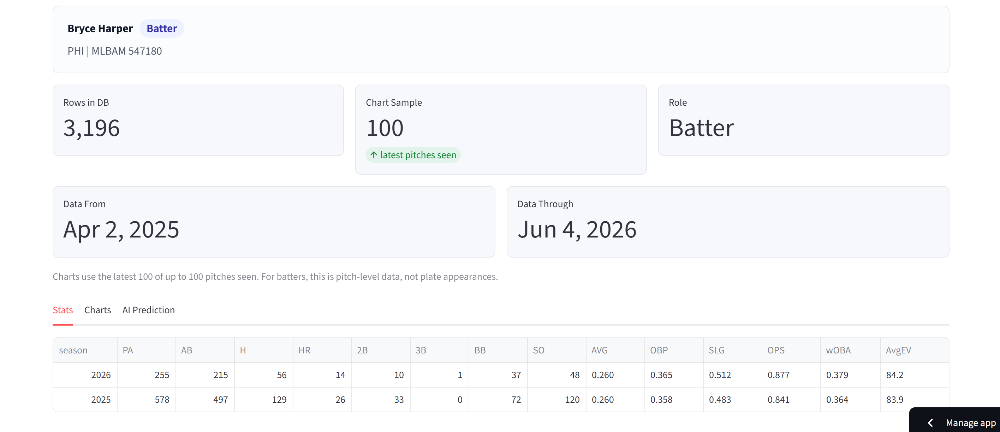
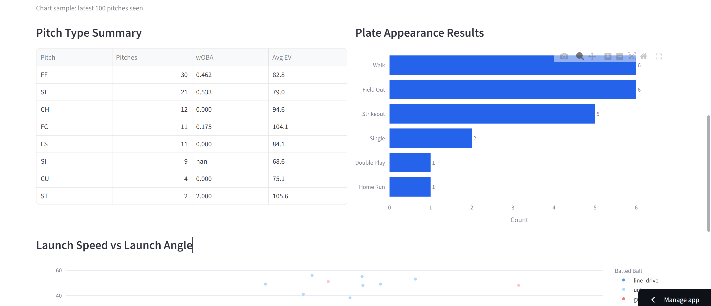
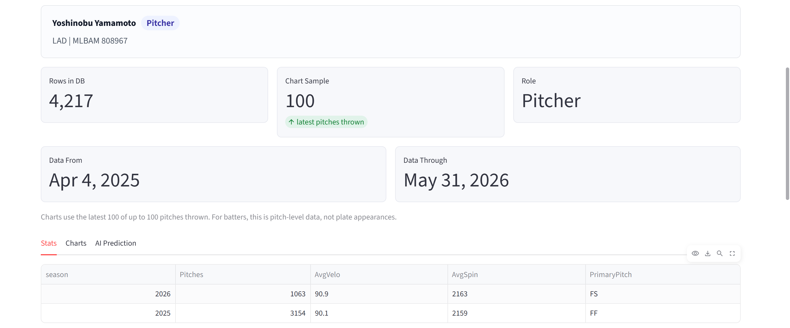
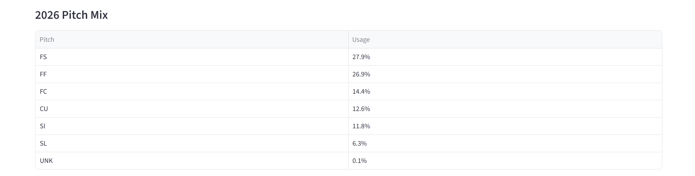
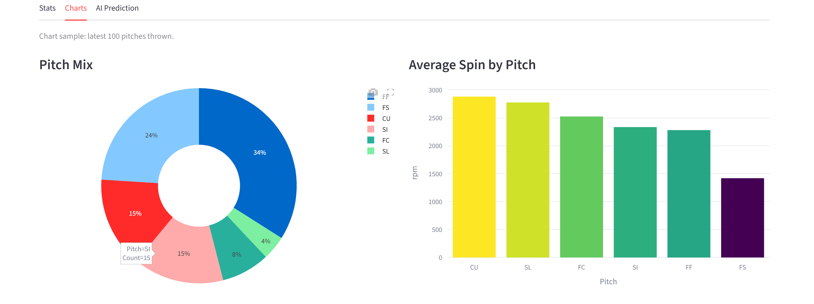
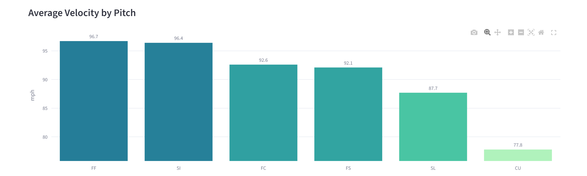
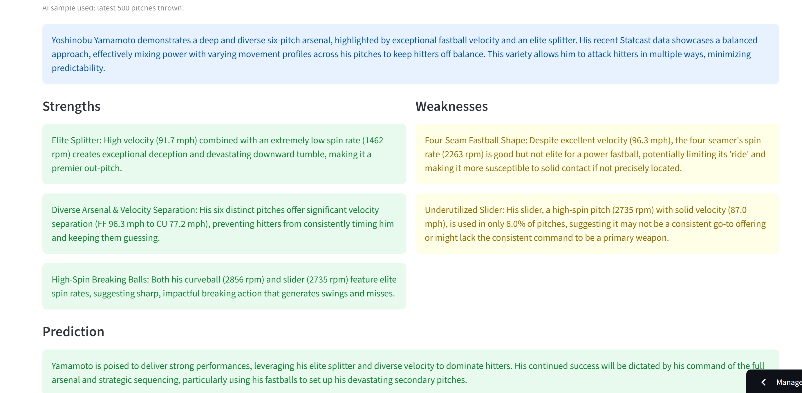
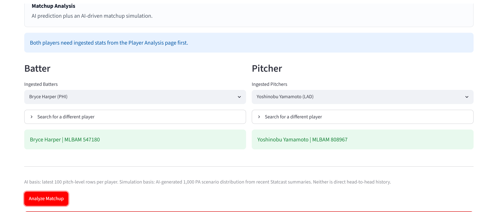
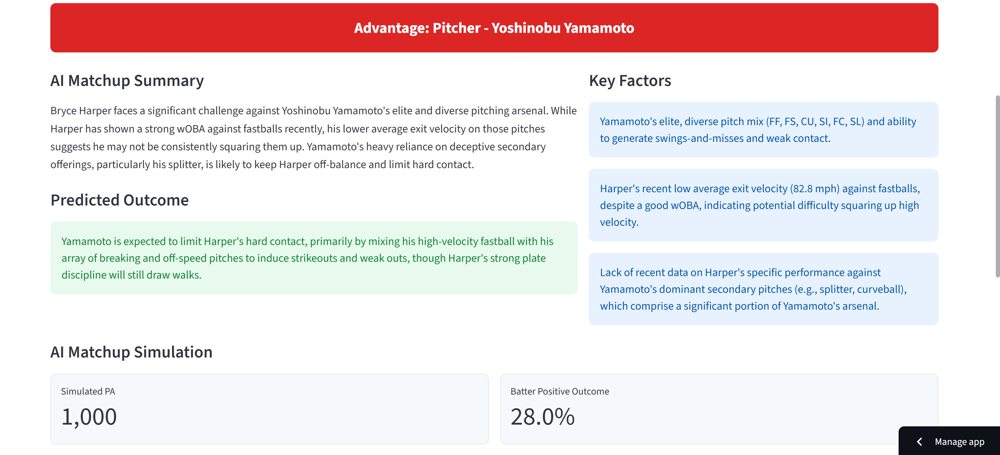
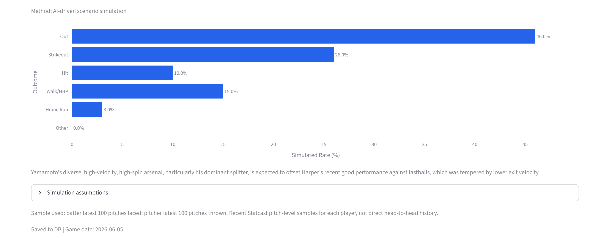

# MLB Player Performance Predictor

> AI-powered MLB player analysis and pitcher-batter matchup prediction, built on real Statcast data.


**[Live Demo](https://mlb-predictor-by-jimin.streamlit.app/)** · **[API Docs](https://mlb-predictor-production-2093.up.railway.app/docs)**

---

## Overview

MLB Player Performance Predictor collects pitch-level Statcast data via pybaseball and serves AI-generated performance predictions and batter vs. pitcher matchup analysis through a FastAPI backend and Streamlit dashboard. Gemini Flash synthesizes recent stat history into structured predictions with confidence scoring, while Celery + Redis handle background ingestion and caching so the UI stays fast.

---

## Live Demo

| | URL |
|---|---|
| Streamlit Dashboard | https://mlb-predictor-by-jimin.streamlit.app/ |
| REST API | https://mlb-predictor-production-2093.up.railway.app |
| API Docs (Swagger) | https://mlb-predictor-production-2093.up.railway.app/docs |

---

## Tech Stack

| Layer | Technology |
|---|---|
| Backend | FastAPI, Python 3.12, SQLAlchemy |
| Database | PostgreSQL 15 |
| Cache / Queue | Redis (6h TTL), Celery + Celery Beat |
| AI | Google Gemini Flash API |
| Data | pybaseball (MLB Statcast / Baseball Savant) |
| Position Detection | MLB Stats API |
| Frontend | Streamlit |
| Deployment | Railway (backend + DB + Redis), Streamlit Cloud (frontend) |
| Local Dev | Docker Compose |

---

## Architecture

```
pybaseball (Statcast)
        │
        ▼
Celery + Redis ──────────────── background daily refresh (4AM UTC)
        │
        ▼
  PostgreSQL ──── batter_stats / pitcher_stats / matchups
        │
        ▼
  Gemini Flash ── structured prediction + matchup analysis
        │
        ▼
   FastAPI REST
        │
        ▼
   Streamlit Dashboard
```

---

## Key Features

- **Auto-ingest** — first player lookup triggers Statcast ingestion automatically; no manual setup needed
- **Position auto-detection** — MLB Stats API maps each player to Pitcher / Batter / Two-Way Player at search time
- **Two-way player support** — TWP players (e.g. Ohtani) let the user manually select Pitcher or Batter role
- **Matchup analysis** — Batter vs. Pitcher AI analysis with 1,000 PA simulation via Gemini Flash
- **Redis-cached predictions** — Gemini results cached with 6h TTL; same player re-requests skip AI call
- **Daily stat refresh** — Celery Beat triggers background ingestion at 4AM UTC
- **Season aggregated stats** — AVG, OBP, SLG, OPS, wOBA computed from raw Statcast rows
- **Pitch-level breakdown** — per pitch-type wOBA and exit velocity for batters; velo, spin, pitch mix for pitchers

---

## API Endpoints

```
GET  /health
GET  /players/search?last=judge&first=aaron
POST /players/ingest
POST /players/fix-positions
GET  /players/{mlbam_id}/stats
GET  /players/{mlbam_id}/season-stats
GET  /players/{mlbam_id}/predict
POST /players/{mlbam_id}/refresh
POST /players/refresh-all
GET  /matchup/{batter_id}/{pitcher_id}
POST /matchup/{batter_id}/{pitcher_id}
```

Full interactive docs at `/docs`.

---

## Local Development

**Requirements:** Python 3.12, Docker Desktop

```bash
# Clone
git clone https://github.com/jiminRolandSong/mlb-predictor.git
cd mlb-predictor

# Environment variables
cp .env.example .env
# Fill in your values (see Environment Variables below)

# Run full stack with Docker Compose
docker-compose up -d

# Or run FastAPI locally (DB + Redis still via Docker)
python -m venv venv
venv\Scripts\activate          # Windows
# source venv/bin/activate     # macOS/Linux
pip install -r requirements.txt
uvicorn app.main:app --reload
```

---

## Environment Variables

| Variable | Description |
|---|---|
| `DATABASE_URL` | PostgreSQL connection string |
| `REDIS_URL` | Redis connection string |
| `GEMINI_API_KEY` | Google Gemini API key |
| `DEBUG` | Enable debug mode (`true` / `false`) |

---

## Screenshots

### Player Analysis — Batter




### Player Analysis — Pitcher






### Matchup Analysis




---

## License

MIT
